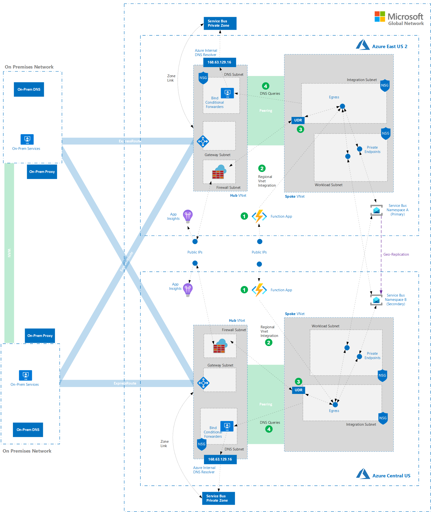

# Azure Cosmos DB Account Multi Region Pattern
## Architecture and Composable Deployment Code
### Implementation

This guide assumes that you are deploying your solution into a networking environment with the following characteristics:

  Azure Cosmos DB architecture.   

- Azure Cosmos DB can be deployed to one or more Azure Regions transparently. For reads, Azure Traffic manager handles routing requests to the requestor's nearest region.

### Azure Cosmo DB
#### Requirements
- Predictable / Consistent Performance
- Direct integration to and accessibility from private networks
- No accessibility from public networks
- Cross Region Replication
#### Implementation
##### TODO: 2 Azure Region Image (It's confusing to talk about 2 adn show 3)
  
The base-level resource for Azure Cosmos DB is an Azure Cosmos DB Account. Accounts contain the entities that we will be working with ( Databases, Containers, Collestions, Documents ).


When creating an account in a single region, there are relatively few decisions needed. The delpoyment requires the name, pricing tier, initial scale and redundancy settings, subscription, resource group, consistency levey and location.

This reference implementation will deploy a SQL API Account. This is the most commonly deployed API and is recommended for most production workloads due to it's flexability and ease of development.    
  
- Create an account in one Azure Region (1)  


- We'll configure geo-redundancy (2) with the another Azure Region by adding it to the Azure Cosmos DB Account. This replicaiton is at the Azure Comos DB Account level, not at the individual database/container level.


- The account will be set up in the same region as the Resource Group it is in. 

- Geo Redundancy will be enabled by deploying to specific regions

- RUs at account or Datbase Level?

- Default Consistency level


- Key Vault

##### TODO: Make this Cosmos Specific
#### Deployment
1. Create resource group for our reference workload
	```bash
	# for East resources
	az group create --location eastus2 --name cosmos-db-rg
	```
2. Create Comos DB Account ([ARM Template](../components/cosmosaccount/cosmosaccount.json))
	```bash
	resourceGroupName='cosmos-db-rg'
	accountName='mycosmosaccount' #needs to be lower case and less than 44 characters

	az cosmosdb create \
    		-n $accountName \
    		-g $resourceGroupName \
    		--default-consistency-level Session \   		
   		--locations regionName='West US 2' failoverPriority=0 isZoneRedundant=False \
		--locations regionName='East US 2' failoverPriority=1 isZoneRedundant=False
	```
	
3. Add region ([ARM Template](../components/cosmosaccount/cosmosaccount.json))
	```bash
	az cosmosdb update --name $accountName --resource-group $resourceGroupName \
		--locations regionName="East US 2" failoverPriority=0 isZoneRedundant=False \
		--locations regionName="West US 2" failoverPriority=1 isZoneRedundant=False  \
		--locations regionName="South Central US" failoverPriority=2 isZoneRedundant=False
	```
4. Enable multiple write regions([ARM Template](../components/cosmosaccount/cosmosaccount.json))
	```bash
	# Get the account resource id for an existing account
	accountId=$(az cosmosdb show -g $resourceGroupName -n $accountName --query id -o tsv)
	az cosmosdb update --ids $accountId --enable-multiple-write-locations true
	```
5. Set failover policy
	```bash
	# Assume region order is initially 'West US 2'=0 'East US 2'=1 'South Central US'=2 for account
	resourceGroupName='myResourceGroup'
	accountName='mycosmosaccount'

	# Get the account resource id for an existing account
	accountId=$(az cosmosdb show -g $resourceGroupName -n $accountName --query id -o tsv)

	# Make South Central US the next region to fail over to instead of East US 2
	az cosmosdb failover-priority-change --ids $accountId \
		--failover-policies 'West US 2=0' 'South Central US=1' 'East US 2=2'
	```
6. Enable Automaic Failover
	```bash
	# Enable automatic failover on an existing account
	resourceGroupName='myResourceGroup'
	accountName='mycosmosaccount'

	# Get the account resource id for an existing account
	accountId=$(az cosmosdb show -g $resourceGroupName -n $accountName --query id -o tsv)

	az cosmosdb update --ids $accountId --enable-automatic-failover true
	```
[top ->](#Architecture-and-Composable-Deployment-Code)    

### Azure Functions
#### Requirements
- Support for Java (version 8)
- Support for .NET Core C# (version 3.1)
- Ability to run in multiple regions (East US 2 and Central US)
- Connectivity to Azure and on-premises private networks
- Dynamic scaling based on incoming event load / queue depth
#### Implementation
  
- A function app (1) will be deployed into each region for hosting our producer and consumer functions  

- Both function apps (1) will be configured to leverage regional VNet integration (2) to send all egress traffic from all functions into a newly created integration subnet in each region.  

- A UDR (3) will be created and assigned to the integration subnet such that all traffic destined for the internet will be sent through Azure Firewall in the hub VNet. This will allow us to filter and audit all outbound traffic.  

- The Firewall will be configured to allow traffic to public App Insights endpoints to enable built-in monitoring facilitated by the Azure Functions host running in the Function App.

- DNS settings on the Spoke VNet will be configured such that all DNS queries (4) originating from subnets in the VNet will be sent to our custom DNS forwarders.
#### Deploy Infrastructure
1. Deploy and Configure the Integration Subnet for Regional VNet Integration for both regions ([ARM Template](../components/integration-subnet/azuredeploy.json)) - *Requires Network Perms*
	```bash
	az deployment group create --resource-group network-eastus2-rg --name integration-eastus2 --template-file ./../components/integration-subnet/azuredeploy.json --parameters existingVnetName=spoke-vnet integrationSubnetPrefix="10.1.6.0/24"
	
	az deployment group create --resource-group network-centralus-rg --name integration-centralus --template-file ./../components/integration-subnet/azuredeploy.json --parameters existingVnetName=spoke-vnet integrationSubnetPrefix="10.3.6.0/24"
	```
2. Deploy App Service Plans ([ARM Template](../components/functions/azuredeploy-plan.json))
	```bash
	# East
	az deployment group create --resource-group refworkload-eastus2-rg --name appplan-eastus2 --template-file ./../components/functions/azuredeploy-plan.json --parameters planName="kskrefeastus2"
	
	# Central
	az deployment group create --resource-group refworkload-centralus-rg --name appplan-centralus --template-file ./../components/functions/azuredeploy-plan.json --parameters planName="kskrefcentralus"
	```
3. Deploy the Function App Storage Accounts ([ARM Template](../components/functions/azuredeploy-storage.json))
	```bash
	# East
	az deployment group create --resource-group refworkload-eastus2-rg --name funcstor-eastus2 --template-file ./../components/functions/azuredeploy-storage.json --parameters storageAccountName="kskrefeastus2"
	
	# Central
	az deployment group create --resource-group refworkload-centralus-rg --name funcstor-centralus --template-file ./../components/functions/azuredeploy-storage.json --parameters storageAccountName="kskrefcentralus"
	```
4. Deploy Function Apps ([ARM Template](../components/functions/azuredeploy-app.json)) TODO: Add Storage to template.
	```bash
	# East
	az deployment group create --resource-group refworkload-eastus2-rg --name app-eastus2 --template-file ./../components/functions/azuredeploy-app.json --parameters planName="kskrefeastus2" appName="kskrefeastus2" vnetName=spoke-vnet subnetName=integration-subnet networkResourceGroup=network-eastus2-rg
	
	# Central
	az deployment group create --resource-group refworkload-centralus-rg --name app-centralus --template-file ./../components/functions/azuredeploy-app.json --parameters planName="kskrefcentralus" appName="kskrefcentralus" vnetName=spoke-vnet subnetName=integration-subnet networkResourceGroup=network-centralus-rg
	```
5. Update Function App Config for routing and storage 
	```bash
	```
#### Deploy Reference Function Code
1. TBD
	```bash
	TBD
	```
2. TBD
	```bash
	TBD
	```
3. TBD
	```bash
	TBD
	```
[top ->](#Architecture-and-Composable-Deployment-Code) 
---
> [Back to TOC](../README.md#TOC) 
